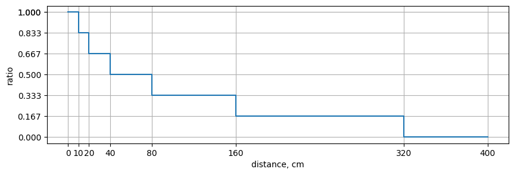
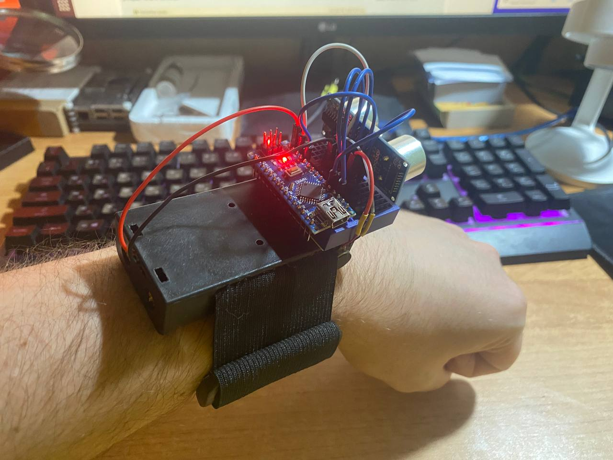
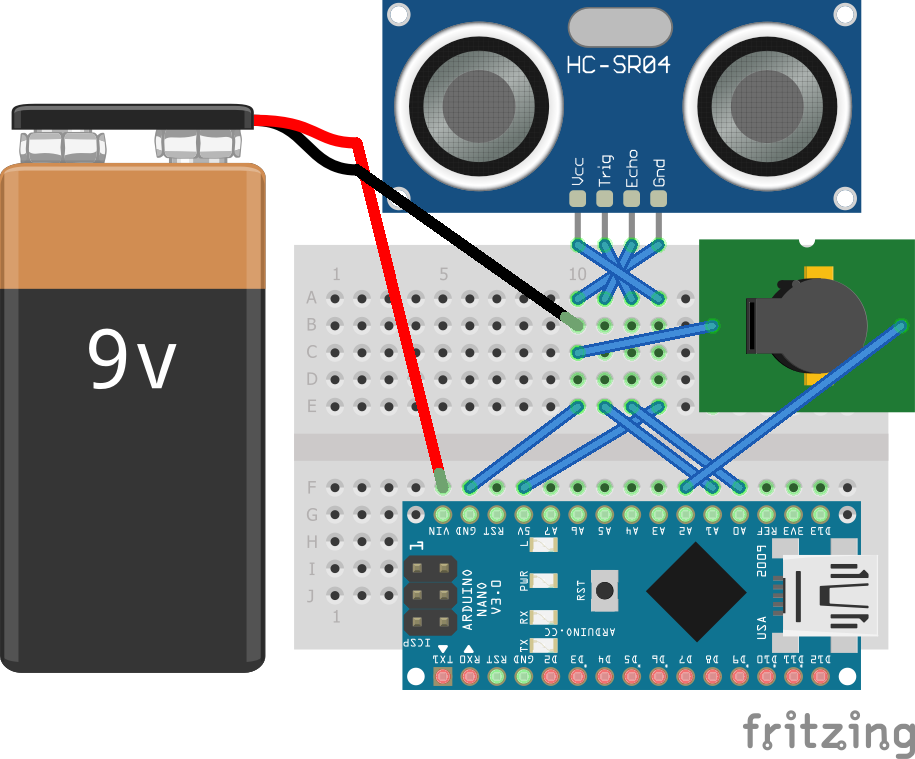

# Arduino Wrist Sonar

## Overview

Tiny project that uses an Arduino and an ultrasonic sensor to measure distances and generate a buzz pattern based on those distances. This project is designed for spatial orientation and can be used to provide haptic feedback on the wrist.

## Method to Calculate Buzz Length and Frequency

The buzz length and frequency are calculated based on the distance measured by the ultrasonic sensor. Here's how it works:

1. **Ultrasonic Distance Measurement**: The ultrasonic sensor measures the distance between the device and an object. The distance is calculated in centimeters using the formula:

   ```distance = pulseIn(echoPin, HIGH) * 0.034 / 2 - palmLength```

   - `pulseIn(echoPin, HIGH)` measures the duration of the echo signal in microseconds.
   - `0.034` represents the speed of sound in centimeters per microsecond.
   - The division by 2 accounts for the round trip of the sound wave.
   - `palmLength` is subtracted to adjust for the distance from the sensor to the palm.

2. **Calculate Buzz Ratio**: The buzz ratio is calculated as follows:

   ```buzzRatio = 1 - floor(log(distance / 10 + 1) / log(2)) / 6```

   - This formula maps the distance to a buzz ratio that ranges from 0 to 1.
   - Ratio defines the buzz frequency and length.

   

3. **Calculate Buzz BPM**: The beats per minute (BPM) for the buzzer are determined using the `buzzRatio`. The BPM varies between `minBpm` and `maxBpm`.

   ```buzzBpm = minBpm + (maxBpm - minBpm) * buzzRatio```

4. **Calculate Buzz Period**: The period for the buzzer is calculated as:

   ```buzzPeriod = 60000 / buzzBpm```

   - It represents the time duration for each beat.

5. **Buzzer Control**: Depending on the `buzzRatio`, the buzzer is controlled as follows:
   - If `buzzRatio` is less than or equal to 0, the buzzer is turned off for the duration of `buzzPeriod`.
   - If `buzzRatio` is greater than or equal to 1, the buzzer is turned on for the duration of `buzzPeriod`.
   - If `buzzRatio` is between 0 and 1, a buzzing pattern is generated by alternating between turning the buzzer on and off based on `buzzTime` and `silenceTime`.

## Components



- Arduino Nano
- Ultrasonic Sensor (HC-SR04)
- Buzzer
- Breadboard
- Power Source:
- Battery holder, flexible strap and triglide slides to make the device wearable

## Device Scheme

